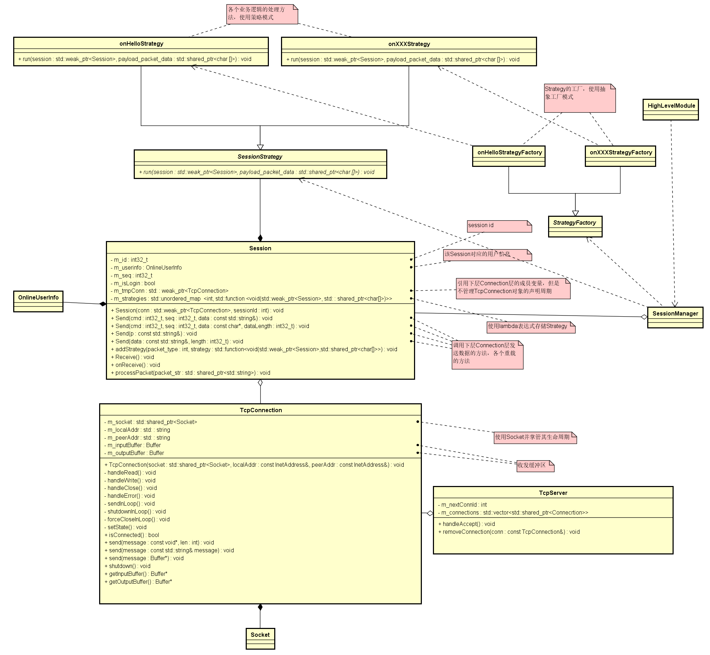
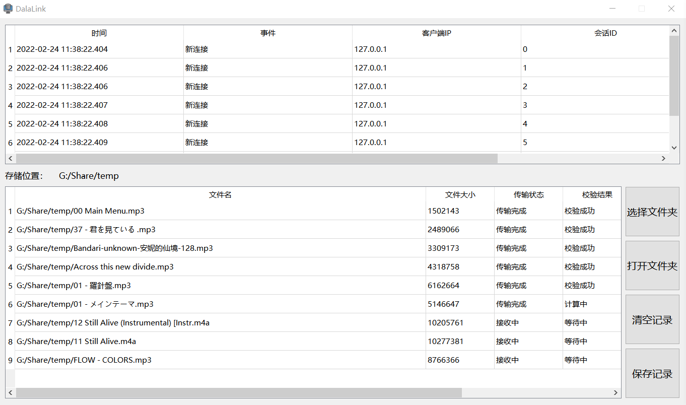
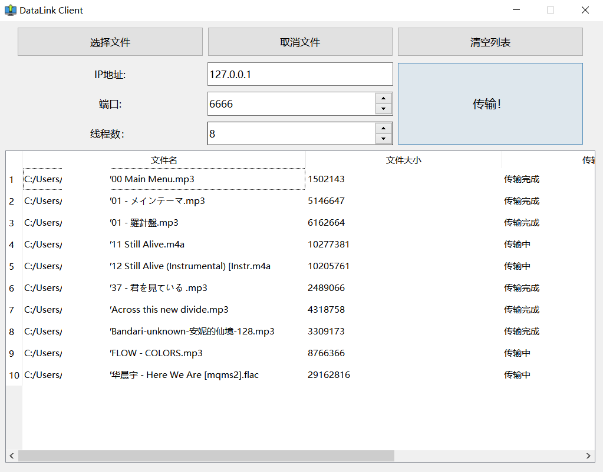

# DataLink文件快传
- 一个个人练习项目，用于实践C++基础编程、C++新特性、软件工程
- 用于满足局域网内多个设备向中心工作机传输文件的需求
- 支持文件的单向高速传输
- 支持多客户端多线程并行传输
- 使用了Boost、Qt、crypto++库

## 底层传输框架设计
### 设计模式和架构
- 底层传输框架编译成lib供DataLink以及其他上层项目调用
- 对于每种包的处理算法使用策略模式，将算法封装成类，使得算法可以独立于使用它的客户程序（稳定的）而变化
- 对于包处理类的的实例化，使用抽象工厂设计模式，来避免客户程序和“多系列具体对象创建工作”的紧密耦合


### 分层
- Session：SessionManager管理生命周期（new和daemon线程检查存活）
- Connection：Server管理生命周期（new和daemon线程检查存活）
- Socket

为了降低耦合，每层对象会有线程一个线程，数据共享需要考虑竞争问题

### 多线程、并发和同步
- 一个Session含一个读取线程，一个Connection含一个读取线程，二者之间对于共享数据的操作需要同步，基于“One thread one loop”的思想，Session层是一个循环，Connection层也可近似看作一个隐式的循环（用了io_context阻塞在run()调用后）
``` c++
    while (共享数据队列非空)
    {
        步骤一：尝试从队列中取数据
        步骤二：处理数据
        步骤三：做其他事情
    }
```

- 按照参考书籍要求，上层业务线程的写操作也应当用共享数据队列缓存起来，然后通过唤醒机制（condition_variable）通知Connection线程发送，很多场合书中都建议使用这种设计以实现各模块职责的明确划分。但是为了性能，实际实现时牺牲一些规范性（Session不应该处理写事务），Session直接调用Connection对象（线程）的发送接口发送数据，发送操作应当被序列化以保证发送顺序的正确性
- 互斥量保护读取队列

### 缓冲区
- Connection每接收到一点数据，就使用std::string包装起来，放入一个和上层Session共享的std::queue缓冲区队列中
- Connection不断向队列中存放数据，Session不断从队列中读取数据，并且以队列中所有数据为读取一次的单位

### 包设计
- 强制1字节对齐，避免对齐造成空间浪费
- 参考TCP协议栈的设计，下层对上层的透明传输，下层把上层整个包作为下层的载荷payload，下层为上层包添加头部以后发送，所以上层和下层的包之间不能有继承关系，更不能有虚函数，因为虚表也会占据一定长度
- 包头一般需要包含包全长，载荷长，版本等明文信息

### 粘包处理
- 由Session负责处理，输入从队列中取出并拼接的std::string，输出为一个完整的Packet，分为4类情况
- 由于包含长度信息，并且根据这个长度读取数据，需要对该值进行合法性校验，接收到非法包（包长非正数、包长大于发送缓冲区长度）就判断为攻击发生，主动断开连接
- 一个Packet经一个多路分发函数解析类型后，交由对应的函数处理

### 包透明加密实现
参考HTTPS的实现，HTTPS的原理是先建立TLS安全链路，双方协商好会话密钥，然后利用该通道传输加密的HTTP包。虽然经过加密后，HTTP包的结构被成功混淆隐藏起来，但是实际上TLS包的一些字段还是必须以明文的形式暴露的，例如TLS包的类型、TLS版本、载荷（HTTP包）的长度等。所以包类型和载荷长度在本实现中也均不加密

### 通信加密算法
过去由于未实现粘包处理算法，包长固定，故选用RC6流式加密算法配合CFB加密模式，使得明文和密文长度一致，便于控制包长，但是代价是对于短块的保护不够，且扩散性不够。

性能方面，实测AES算法在Intel CPU上加密大数据时比RC6快大约20倍，故目前选用AES-128算法配合CBC加密模式

**后期考虑加入密钥协商机制，定时更换密钥提高安全性**

### 性能测试
- 测试环境：2台Windows 7 x64虚拟机
- 测试方法：传输100MB大小的文件，记录峰值带宽占用

| 底层缓冲区大小 | 加密算法 | 内存占用 | 带宽占用（总带宽为1Gbps） | 近似传输速度 |
| :--------: | :--------: | :--------: | :---------: | :---------: |
| 16KB | RC6 | 1MB | 5% | 5MB/s |
| 16KB | AES-128 | 1MB | 6% | 7.5MB/s |
| 64KB | AES-128 | 1.5MB | 25% | 22.5MB/s |
| 128KB | AES-128 | 2.5MB | 37.5% | 46.875MB/s |
基本可以达到局域网内的理想速率


## 主要功能
服务端和客户端的运行截图如下（UI还没有美化）

客户端显示客户端连接的时间、ip等信息，以及接收到的所有文件。在每个文件传输完成后，计算其SHA-256，与客户端发送的SHA-256值校验

客户端支持至多10线程并行传输



## 参考书籍
《C++服务器开发精髓》、《C++并发编程实战》